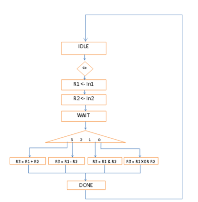
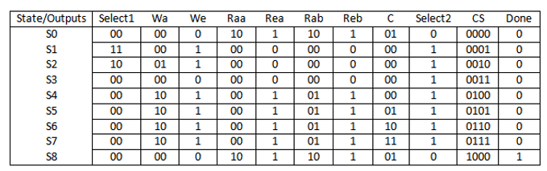
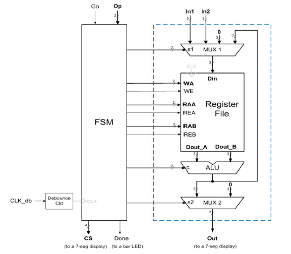

# FPGA Verilog code for a small calculator.

## Capable of performing ADD, SUBTRACT, AND, and XOR operations.

Look at the diagrams to know the layouts of the modules.

### ASM_Chart

### ControlUnitTable

### DesignLayout_BlockDiagram
